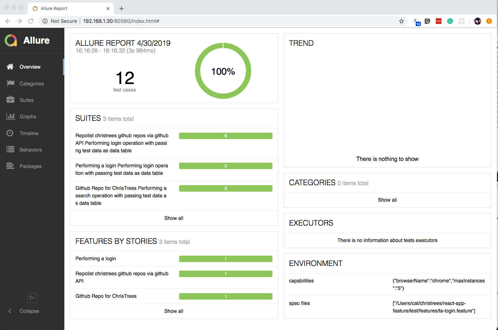

# react-app-feature Documentation
react-app UX Feature Testing Automation

### Quickstart

1. catmini:christrees cat$ git clone https://github.com/christrees/react-app-feature.git
2. catmini:christrees cat$ cd react-app-feature
3. catmini:react-app-feature cat$ yarn install
4. catmini:react-app-feature cat$ yarn test
5. catmini:react-app-feature cat$ yarn allure-report

    

### ToDo

- Explain workflow
- Explain file structure
- Explain pageobject stuff
- Explain DSL <-> CSS <-> UC stuff
- Walk through a lifecycle